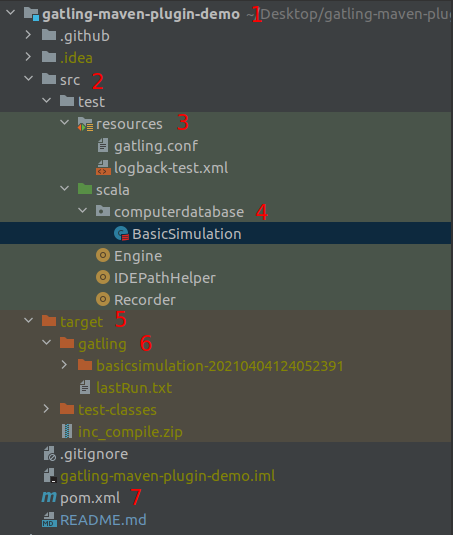

Инструкция по использованию Gatling
===================================
Gatling – это известный фреймворк, предназначенный для выполнения нагрузочного тестирования. Его работа основана на трёх технологиях: Scala, Akka и Netty.

<details>
    <summary>Предварительные требования</summary>
    
### Java Version
Gatling поддерживает 64битную версию OpenJDK 8 и OpenJDK 11 с HotSpot.
    
<!-- ###Scala Version
Для Gatling 3.5 требуется Scala 2.13. Для версий Gatling с 3.0 до 3.4 требуется Scala 2.12.
-->
   
### Build Tool
В зависимости от инструмента скачайте необходимую версию демо проекта.
В данном примере мы будем использовать Maven.

[Maven](https://github.com/gatling/gatling-maven-plugin-demo)

[Sbt](https://github.com/gatling/gatling-sbt-plugin-demo)

[Gradle](https://github.com/gatling/gatling-gradle-plugin-demo)

### IDE
Советую использовать IntelliJ IDEA с совместимым Scala Plugin.

</details>

<details>
    <summary>Строение проекта</summary>    


    
1) Название проекта.
2) Основные ресурсы проекта.
3) Основные настройки:
  - `gatling.conf` основные настройки Gatling.
  - `logback-test.xml` настройки логирования и интерфейсов вывода логов.
4) Директория scala содержит пакеты с тестами. Так же есть несколько дополнительных файлов для совместимости с IDE.
5) Директория для хранения собранного проекта.
6) В директории генерируются отчеты по логу запуска (тот что вы видите в консоли).
7) Базовый модуль Maven.
    
</details> 

<details>
    <summary>Строение симуляции</summary>

## Симуляция
Симуляция это инструмент проведения нагрузочного тестирования. Тут описывается всё, начиная от фидеров и сценариев действий пользователей, до подачи загрузки.    
Обычно симуляция состоит из 4 частей. Для больших проектов с множеством сценариев лучше хранить эти части отдельно.

### Протокол
Здесь задаются нужные хедеры, базовый URL и другие настройки: например, указываем прокси или отключаем кеширование.

[Подробнее о протоколе](https://gatling.io/docs/current/http/http_protocol/)

<details>
    <summary>Пример протокола</summary>
    
```
val httpProtocol = http
    .baseUrl("http://computer-database.gatling.io") // Here is the root for all relative URLs
    .acceptHeader("text/html,application/xhtml+xml,application/xml;q=0.9,*/*;q=0.8") // Here are the common headers
    .acceptEncodingHeader("gzip, deflate")
    .acceptLanguageHeader("en-US,en;q=0.5")
    .userAgentHeader("Mozilla/5.0 (Macintosh; Intel Mac OS X 10.8; rv:16.0) Gecko/20100101 Firefox/16.0")
```
</details>

### Сценарий
Сценарий выполнения запросов.
Тут подробно описываются последовательные действия пользователей, так же есть возможность ветвления и прерывания действий в зависимости от ответа.

[Подробнее о сценарии](https://gatling.io/docs/current/general/scenario/)

<details>
    <summary>Пример сценария</summary>
    
```
val scn = scenario("Scenario Name") // A scenario is a chain of requests and pauses
    .exec(http("request_1")
      .get("/")
      .check(status.is(200)))
    .pause(7) // Note that Gatling has recorder real time pauses
    .exec(http("request_2")
      .get("/computers?f=macbook")
      .check(status.not(404), status.not(500)))
    .pause(2)
    .exec(http("request_3")
      .get("/computers/6"))
    .pause(3)
    .exec(http("request_4")
      .get("/"))
    .pause(2)
    .exec(http("request_5")
      .get("/computers?p=1"))
    .pause(670.milliseconds)
    .exec(http("request_6")
      .get("/computers?p=2"))
    .pause(629.milliseconds)
    .exec(http("request_7")
      .get("/computers?p=3"))
    .pause(734.milliseconds)
    .exec(http("request_8")
      .get("/computers?p=4"))
    .pause(5)
    .exec(http("request_9")
      .get("/computers/new"))
    .pause(1)
    .exec(http("request_10") // Here's an example of a POST request
      .post("/computers")
      .formParam("""name""", """Beautiful Computer""") // Note the triple double quotes: used in Scala for protecting a whole chain of characters (no need for backslash)
      .formParam("""introduced""", """2012-05-30""")
      .formParam("""discontinued""", """""")
      .formParam("""company""", """37"""))
```
exec — метод, по которому нагрузочный профиль выполняет единичное действие. Например, отправляет запрос, открывает сокет, отправляет сообщение по сокету или выполняет анонимную функцию.

http(samplerName: String).(get|post|put…) отправляет необходимый запрос http. В функции метода http указываем относительный путь. Базовый url мы уже указали при настройке конфига http. Далее указываем параметры запроса — queryParam | formParam.

check проверяет ответ. Можно проверить заголовок ответа. Мы также используем check, когда хотим проверить и сохранить тело ответа или его отдельные элементы.
</details>

### Запрос
Здесь описывается одно из действий пользователя. Тут же можно генерить тела для POST запросов и задавать проверку ответов.

[Подробнее о запросах](https://gatling.io/docs/current/http/http_request/)

<details>
    <summary>Примеры запросов</summary>

Get запрос    
```
.exec(http("request_1")
  .get("/"))
```

Post запрос
```
.exec(http("request_10") // Here's an example of a POST request
  .post("/computers")
  .formParam("""name""", """Beautiful Computer""") // Note the triple double quotes: used in Scala for protecting a whole chain of characters (no need for backslash)
  .formParam("""introduced""", """2012-05-30""")
  .formParam("""discontinued""", """""")
  .formParam("""company""", """37"""))
```
</details>

### Инжектор
Инжектор пользователей. Отвечает за ввод пользователей в сценарий. Можно выбирать открытую либо закрытую модели подачи нагрузки.

[Подробднее об инжекторе](https://gatling.io/docs/current/general/simulation_setup/)

<details>
    <summary>Примеры инжекторов</summary>

Открытая модель
```
setUp(
  scn.inject(
    nothingFor(4.seconds),
    atOnceUsers(10),
    rampUsers(10).during(5.seconds),
    constantUsersPerSec(20).during(15.seconds),
    constantUsersPerSec(20).during(15.seconds).randomized,
    rampUsersPerSec(10).to(20).during(10.minutes),
    rampUsersPerSec(10).to(20).during(10.minutes).randomized,
    heavisideUsers(1000).during(20.seconds)
  ).protocols(httpProtocol)
)
```
Закрытая модель
```
setUp(
  scn.inject(
    constantConcurrentUsers(10).during(10.seconds),
    rampConcurrentUsers(10).to(20).during(10.seconds)
  )
)
```

</details>

<details>
    <summary>Пример нестандартной симуляции</summary>

В данном примере мы задаём общую продолжительность в теле самой симуляции, так как нам требуется длительное нахождение пользователя внутри системы для выполнения запросов.
    
Сценарий овечает за количество и продолжительность действий каждого пользователя.
Точку встречи renderVouz мы используем чтобы точно спрогнозировать конечный RPS.
Пока общее количество пользователей в сценарии не будет равно 28, следующие шаги не начнутся.
during описывает общую продолжительность действий пользователя.
pace гарантирует что пользователь совершит не более одного прохода сценария за 30 секунд.
pause индивидуальное время ожидания для каждого пользователя перед совершением действия.
Первый ждёт 1 секунду перед оправкой запроса, а 28 ждёт 28 секунд. В итоге конечный RPS не превышает 1.
```    
    	val rampSim = scenario("RampSimalation")
    		.rendezVous(28)  // контрольная точка встречи 28 пользователей, чтобы они не начинали запросы до ввода всех пользователей
    		.during(36000 seconds) { // общая продолжительность теста в секундах
    			pace(30 seconds) // длительность одной итерации в которой каждый пользователдь отправит один запрос
    				.pause((s:Session) => s.userId.seconds) // кастомное время ожидание для каждого пользователя в зависимости от его порядкового номера
    				.exec(http("mainPage")
    					.get("/")
    				)
    		}
```
Инжектор отвечает за ввод пользователей в программу.
Чтобы вводить стабильно 1 пользователя раз в 13 секунд, нужно вводить 1/13(0.077) пользователя в секунду.
Чтобы ввести 28 пользователей нужна продолжительность 28 * 13(364).
```
    	setUp(
    		rampSim.inject(
    			constantUsersPerSec(0.077) during (364 seconds)
    		).protocols(httpProtocol)
    	)
```    
</details>

</details>

<details>
    <summary>Запуск тестирования</summary>

Для запуска одной симуляции используйте команду:
    
    $mvn gatling:test -Dgatling.simulationClass=computerdatabase.BasicSimulation
    
Либо команда для запуска всех симуляций одновременно:
    
    $mvn gatling:test
    
</details>

<details>
    <summary>HTTPS запросы</summary>
    
Gatling TrustStore по умолчанию не проверяет сертификаты, а это означает, что он работает из коробки с самозаверенными сертификатами.

Для того чтобы подключить уникальные ключи, опишите их тип и расположение в `gatling.conf` в секции `ssl` (`keyStore` и `trustStore`).

</details>

<details>
    <summary>Мониторинг Gatling в реальном времени</summary>
    
Для мониторинга в реальном времени нам потребуется InfluxDB и Grafana.

### Настройка Gatling

Для начала откроем `gatling.conf` и дойдём до раздела `data`.
раскомментируем `writers` и добавим в строку `graphite`.
```
writers = [console, file, graphite]
```
Так же раскомментируем всю секцию `graphite`. Не забудем указать `host` и `port` базы данных influx.
```
graphite {
      light = false              # only send the all* stats
      host = "127.0.0.1"         # The host where the Carbon server is located
      port = 2003                # The port to which the Carbon server listens to (2003 is default for plaintext, 2004 is default for pickle)
      protocol = "tcp"           # The protocol used to send data to Carbon (currently supported : "tcp", "udp")
      rootPathPrefix = "gatling" # The common prefix of all metrics sent to Graphite
      bufferSize = 8192          # Internal data buffer size, in bytes
      writePeriod = 1            # Write period, in seconds
}
```

### Настройка InfluxDB
Откроем файл `influxdb.conf`(по умолчанию находится в `/etc/influxdb/influxdb.conf`) и дойдём до секции:
```
### [[graphite]]
###
### Controls one or many listeners for Graphite data.
```
И добавим после него:
```
[[graphite]]
  # Determines whether the graphite endpoint is enabled.
  enabled = true
  database = "gatlingdb"
  retention-policy = ""
  bind-address = ":2003"
  protocol = "tcp"
  consistency-level = "one"

  templates = [
                "gatling.*.*.*.* measurement.simulation.request.status.field",
                "gatling.*.users.*.* measurement.simulation.measurement.request.field"
  ]
```
Обратите внимание что порты в `gatling.conf` и `influxdb.conf` должны совпадать.

### Настройка Grafana

Для Grafana требуется только добавить новый dashboard который вы можете сделать сами, либо найти готовый. [Например](https://github.com/gatling/gatling/blob/master/src/sphinx/realtime_monitoring/code/gatling.json). И подключить к нему вашу InfluxDB в качестве `datasource`.
    
</details>
